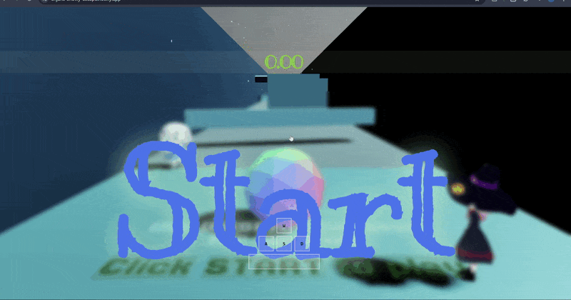
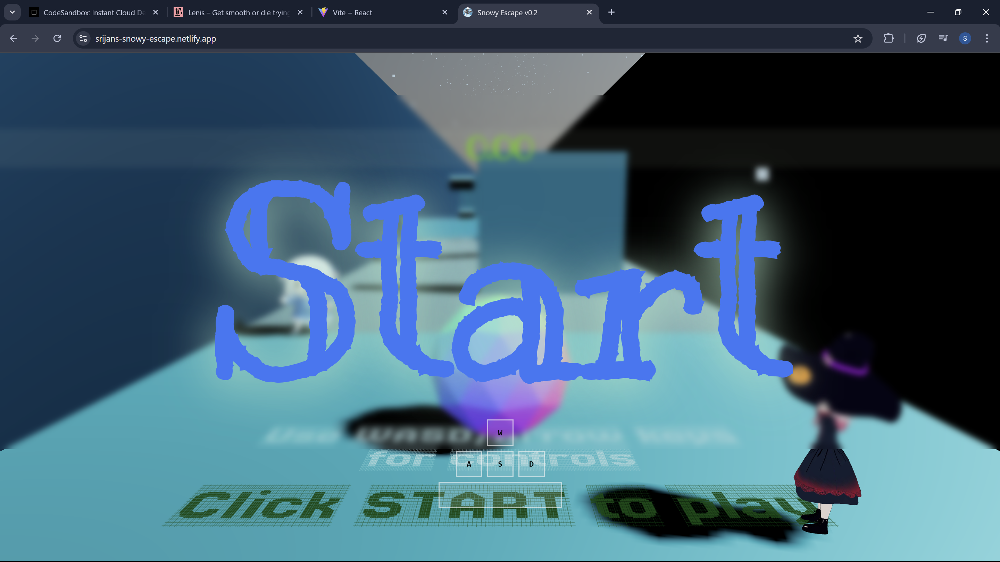
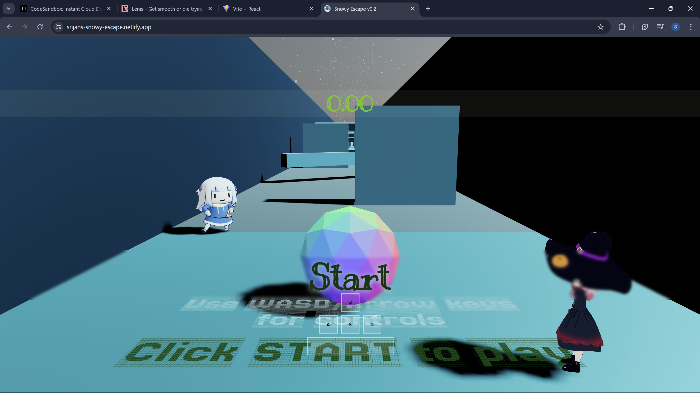
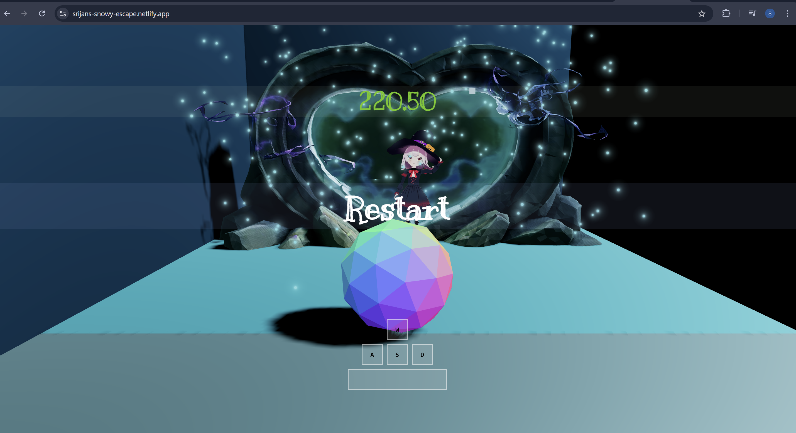

# ❄️ Snowy Escape

 <!-- Replace with your own GIF or banner -->

> 🕹️ **My first fully-playable 3D game** built using cutting-edge web technologies.  
> Dive into a chilly, immersive world — all from your browser!

---

### 🌐 **Play Now**
🧊 [srijans-snowy-escape.netlify.app](https://srijans-snowy-escape.netlify.app)

---

## 🚀 Tech Stack

| Frontend | 3D & Assets | Other Tools |
|----------|-------------|-------------|
| `React.js` | `Three.js` | `Vite` |
| `JavaScript` | `React Three Fiber` | `Netlify` |
| `Tailwind CSS` | `Blender (for models correction and optimization)` | `GSAP (for animations)` |

---

## 🎮 Gameplay Highlights

- ❄️ Real-time 3D terrain and snow-themed environment
- ⚽Ball movement and camera controls
- 💡 Realistic lighting, shadows, and textures
- 🌍 Fully playable **inside your browser**

---

## 🧠 Behind the Scenes

> This was my first big dive into **React Three Fiber**, **Blender workflows**, and **web-based game design**.  
> All the models used are under free-use licenses and credit goes to their respective owners, All I did was optimized and exported them as GLTF, and integrated them into the scene using R3F.

I also learned:
- Managing complex 3D scenes with performance in mind
- Complex React workflows and 'wiring up' the components
- Global State management with Zustand
- Integrating physics and interactions (in progress for v2!)
- Optimizing for web deployment and responsiveness

---

## 📸 Screenshots

 <!-- Put your main game environment screenshot here -->

 <!-- Screenshot of character in motion -->

 <!-- Screenshot showing lighting/shadow setup -->

---
## Expansions, Updates and Patches
>I am learning quite a bit of stuff right now😓 but I do plan to expand it.
>Will get back to it after I finish my current projects.
---

## 📦 Installation (for local dev)

```bash
git clone https://github.com/Srijan-Petwal/snowy-escape.git
cd snowy-escape
npm install
npm run dev

